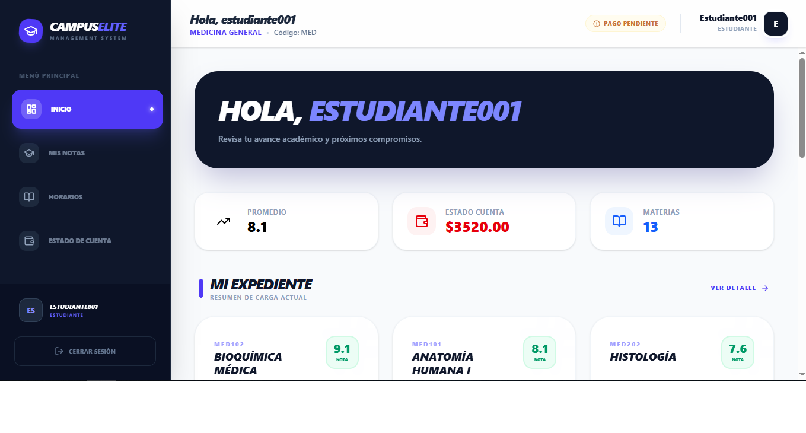
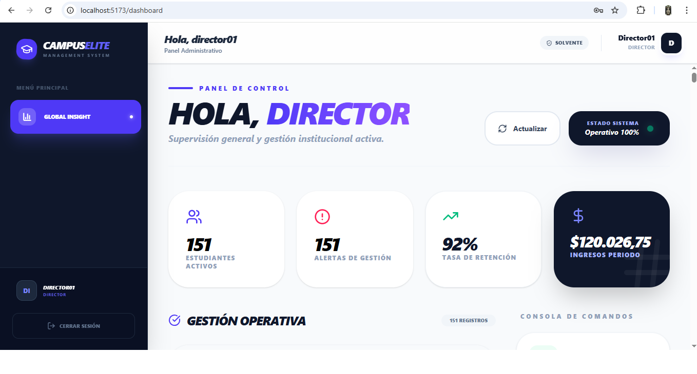
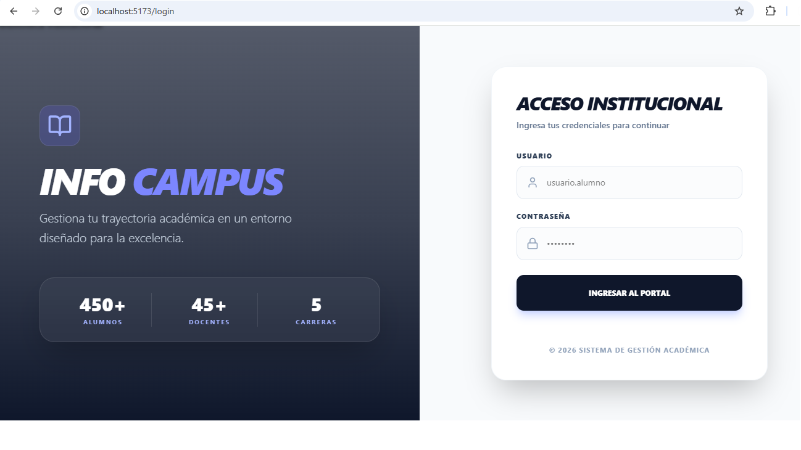
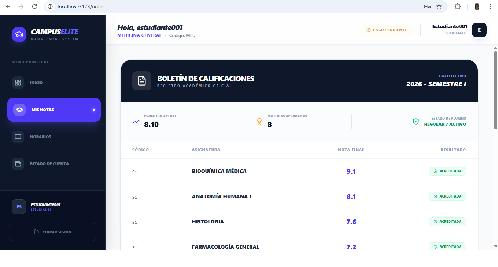
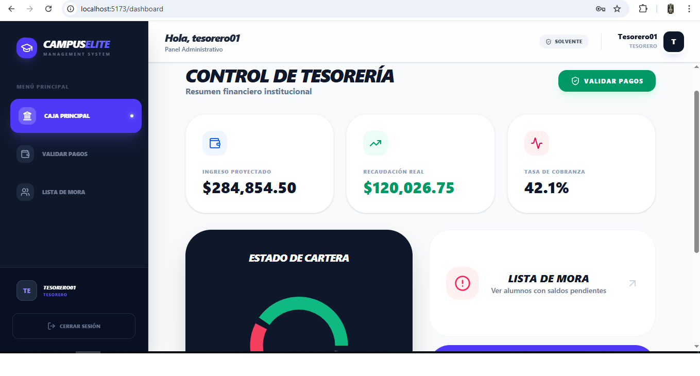
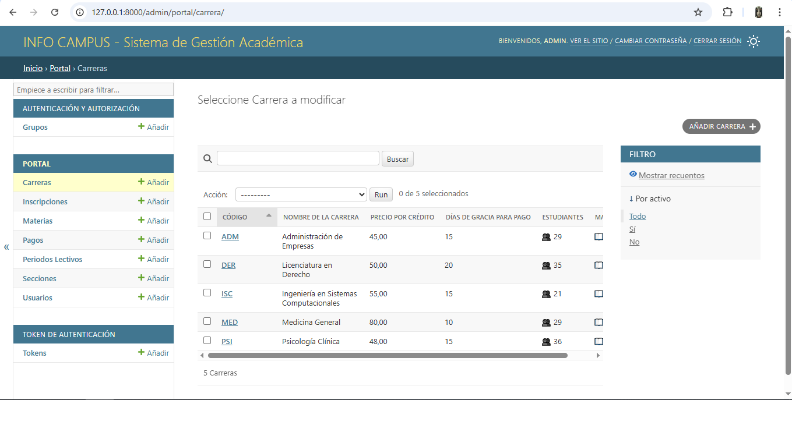

# 🎓 INFOCAMPUS: High-Performance University ERP System

<div align="center">


**An enterprise-grade institutional ecosystem optimized through strategic AI-Driven workflows.**
</div>

---

## 📸 Executive Summary & Business Value
> **Strategic Efficiency:** This project is a showcase of modern software engineering productivity. By mastering **AI Orchestration**, I have developed a high-tier MVP that traditionally requires months of development, drastically reducing **Time-to-Market** while maintaining enterprise standards in security, scalability, and data integrity.

### 🌟 Key Value Propositions:
* **Operational Excellence:** Full-scale ERP handling complex friction between academic and financial departments.
* **Cost & Time Optimization:** Demonstration of how AI-Driven methodologies can accelerate the software development lifecycle (SDLC).
* **Role-Based Security (RBAC):** Advanced permission architecture for Students, Professors, Treasurers, Coordinators, and Directors.
* **Data-Driven Decision Making:** Integrated analytical dashboards for real-time institutional oversight.

---

## 🚀 The Institutional Core
**InfoCampus** isn't just a management tool; it's a solution for the modern university's operational challenges. From automated **Scholarship Logic** to **Intelligent Delinquency Algorithms** that protect institutional cash flow, every module is designed with a "Business-First" mindset.

| Access Interface | Strategic Dashboard |
| :---: | :---: |
|  |  |
| *Security & Branding* | *Real-time Analytics* |

---


# 🎓 InfoCampus - University Management ERP System

> A comprehensive Enterprise Resource Planning system designed for higher education institutions, featuring role-based access control, intelligent financial management, and automated academic workflows.



---

## 📋 Overview

**InfoCampus** is a full-stack ERP solution built to streamline university operations. The system provides differentiated access and functionality across five institutional roles, ensuring secure and efficient management of academic, administrative, and financial processes.

### Core Capabilities

- **Role-Based Access Control (RBAC)** - Five distinct user roles with granular permissions
- **Academic Management** - Complete curriculum, enrollment, and grading system
- **Financial Intelligence** - Automated debt calculation, scholarship management, and payment processing
- **Dashboard Analytics** - Real-time KPIs and insights tailored to each user role
- **Audit Trail** - Complete traceability of all critical operations

---

## 🏗️ System Architecture

### Technology Stack

| Layer | Technology |
|-------|------------|
| **Frontend** | React 19.2 + Vite 7.2 + Tailwind CSS 4.1 |
| **Backend** | Django 6.0.1 + Django REST Framework 3.16.1 |
| **Database** | SQLite with Django ORM |
| **Authentication** | JWT (djangorestframework-simplejwt 5.5.1) |
| **UI Components** | Framer Motion + Recharts + Lucide Icons |
| **API** | RESTful architecture with CORS support |

### Architecture Diagram

```
┌─────────────────────────────────────────┐
│       FRONTEND (React + Vite)           │
│  ┌────────────────────────────────┐    │
│  │  Dashboard Components          │    │
│  │  React Router + Axios          │    │
│  │  Tailwind CSS + Animations     │    │
│  └────────────────────────────────┘    │
└──────────────┬──────────────────────────┘
               │ REST API (JWT Auth)
┌──────────────┴──────────────────────────┐
│   BACKEND (Django REST Framework)       │
│  ┌────────────────────────────────┐    │
│  │  API Views & Serializers       │    │
│  │  Business Logic Layer          │    │
│  │  Django ORM Models             │    │
│  │  RBAC & Permissions            │    │
│  └────────────────────────────────┘    │
└──────────────┬──────────────────────────┘
               │
┌──────────────┴──────────────────────────┐
│        DATABASE (SQLite)                │
│  Careers | Subjects | Sections          │
│  Users | Enrollments | Payments         │
└─────────────────────────────────────────┘
```

---

## 👥 User Roles & Dashboards

### Student Portal

Students can access their academic progress, view schedules, check grades (if accounts are current), and monitor their financial status.


**Key Features:**
- 📊 Real-time GPA calculation
- 💳 Account balance and payment status
- 📚 Current semester course load
- 🔒 Grade access control (blocked if account is overdue)



---

### Professor Interface

Professors manage their assigned sections, input grades, and track student performance across courses.


**Key Features:**
- 📋 Section management and class rosters
- ✏️ Grade input and modification with audit trail
- 📅 Schedule overview with room assignments
- 📊 Student performance analytics


---

### Treasurer Dashboard

The financial management hub provides comprehensive control over institutional revenue, collections, and outstanding debts.



**Key Features:**
- 💰 Projected vs. actual revenue tracking
- 📈 Collection rate monitoring (42.1% in example)
- ⚠️ Delinquency list management
- 📊 Financial health indicators by program


---

### Director Control Panel

Executive oversight with institution-wide metrics, operational status, and strategic insights.


**Key Features:**
- 👥 Active student enrollment: 151
- ⚠️ Management alerts: 151
- 📈 Retention rate: 92%
- 💵 Period revenue: $120,026.75
- ✅ System status: 100% operational

---

## 🔐 Intelligent Financial System

### Automatic Debt Calculation

The system implements sophisticated logic to determine student account status:

```python
Student is delinquent if:
1. ❌ Has unpaid enrollments from PREVIOUS periods
2. ❌ Has enrollments from current period that exceeded grace period
3. ✅ EXCEPT if has an active payment plan agreement
```

### Scholarship Management

- Supports scholarship discounts: 25%, 50%, 75%, or 100%
- Automatic application at payment registration
- Real-time cost calculation based on credits

**Formula:**
```
Base Cost = Credits × Price per Credit

If scholarship exists:
  Discount = Base Cost × (Scholarship % / 100)
  Final Cost = Base Cost - Discount
```

### Grade Access Control

Students with outstanding debts **cannot view their grades** until their account is current. The system displays:
- Exact amount owed
- Payment options
- Grace period remaining (if applicable)

---

## 📊 Data Population System

Four specialized Python scripts generate a complete, realistic university ecosystem for testing and demonstration:

### Script 1: `1_malla.py` - Academic Structure
```
✓ 5 University programs
✓ 30 Subjects (6 per program)
✓ Credits: 2-5 per subject
✓ Differentiated pricing: $45-$80/credit
```

### Script 2: `2_secciones.py` - Time Logistics
```
✓ 4 Academic periods (3 closed + 1 active)
✓ ~60 Sections (2 per subject)
✓ Schedules: 7:00 AM - 8:00 PM
✓ Room and day assignments
```

### Script 3: `3_poblacion.py` - Users & RBAC
```
✓ 150 Students
✓ 20 Professors
✓ 2 Directors
✓ 3 Coordinators
✓ 3 Treasurers
✓ Credential files generated in credenciales/ folder
✓ Default password: InfoCampus2026
```

### Script 4: `4_actividad.py` - Academic Activity
```
✓ ~750-900 Current enrollments
✓ ~1,200 Historical enrollments
✓ 20% failing grades (validation)
✓ 80% payments completed
✓ 20% delinquent students (validation)
```

---

## 🚀 Installation & Setup

### Prerequisites

- Python 3.8+
- Node.js 16+
- pip & npm

### Backend Setup (Terminal 1)

```bash
# Create virtual environment
python -m venv venv
source venv/bin/activate  # Linux/Mac
# venv\Scripts\activate   # Windows

# Install dependencies
pip install -r requirements.txt

# Configure database
python manage.py makemigrations
python manage.py migrate

# Run population scripts IN ORDER
python 1_malla.py
python 2_secciones.py
python 3_poblacion.py
python 4_actividad.py

# Start development server
python manage.py runserver
```

**Backend will be available at:** `http://localhost:8000`

---

### Frontend Setup (Terminal 2)

```bash
# Navigate to frontend directory
cd frontend

# Install dependencies
npm install

# Start development server
npm run dev
```

**Frontend will be available at:** `http://localhost:5173`

---

## 🛠️ Django Admin Interface

The system includes a fully configured Django admin panel for advanced management:


**Access:** `http://localhost:8000/admin/`

**Features:**
- User and group management
- Direct database access
- Token administration
- Complete CRUD operations on all entities



---

## 📈 Key Metrics

### System Volume

| Entity | Quantity |
|--------|----------|
| Programs | 5 |
| Subjects | 30 |
| Academic Periods | 4 |
| Sections | ~60 |
| Total Users | 178 |
| Enrollments | ~1,950 |
| Payment Records | ~600 |

### Codebase

- **Backend (Python):** ~1,500 lines
- **Frontend (JavaScript/React):** ~2,000 lines
- **Population Scripts:** ~500 lines
- **Total:** ~4,000 lines

---

## 🎨 UI/UX Features

- ✅ **Responsive Design** - Mobile, tablet, and desktop optimized
- ✅ **Consistent Design System** - Unified color palette and typography
- ✅ **Reusable Components** - Modular React component library
- ✅ **Smooth Animations** - Framer Motion transitions
- ✅ **Visual Feedback** - Loading states and informative messages
- ✅ **Interactive Tables** - Sorting, pagination, and filtering
- ✅ **Dynamic Charts** - Real-time data visualization with Recharts

---

## 🔧 Core Dependencies

### Backend
```
Django==6.0.1
djangorestframework==3.16.1
djangorestframework-simplejwt==5.5.1
django-cors-headers==4.9.0
Faker==40.1.2
Pillow==12.1.0
python-dotenv==1.2.1
```

### Frontend
```
react==19.2.0
vite==7.2.4
tailwindcss==4.1.18
axios==1.13.2
react-router-dom==7.13.0
recharts==3.7.0
framer-motion==12.29.2
lucide-react==0.563.0
```

---

## 📚 Use Cases

### Student
- ✅ View class schedules
- ✅ Check grades (if account is current)
- ✅ Review financial status
- ✅ Access academic history

### Professor
- ✅ Input and modify grades
- ✅ View student rosters
- ✅ Manage assigned sections
- ✅ Access performance analytics

### Treasurer
- ✅ Process payments
- ✅ Generate financial reports
- ✅ Manage delinquencies
- ✅ Monitor collection rates

### Coordinator
- ✅ Manage sections
- ✅ Assign professors
- ✅ Generate academic reports
- ✅ View institutional statistics

### Director
- ✅ Full system access
- ✅ Configure programs and periods
- ✅ Executive dashboard
- ✅ Institution-wide reporting

---

## 🔒 Security Features

- 🔐 **JWT Authentication** - Secure token-based auth
- 👤 **RBAC System** - Granular permission control
- 📝 **Audit Trail** - Complete change tracking
- 🛡️ **CORS Protection** - Controlled cross-origin requests
- 🔑 **Password Hashing** - Django's built-in security

---

## 🏆 Key Achievements

### 1. Scalable Architecture
- Decoupled frontend and backend
- RESTful API design
- Modular component structure
- Normalized database schema

### 2. Code Quality
- Clean MVC architecture
- Reusable components
- Comprehensive commenting
- Best practices implementation

### 3. Operational Realism
- Real-world data simulation
- Business logic validation
- Edge case handling
- Comprehensive testing data

### 4. User Experience
- Intuitive navigation
- Role-specific interfaces
- Responsive design
- Professional aesthetics

### 5. Security & Compliance
- Robust authentication
- Granular access control
- Complete audit trail
- Data protection

---

## 📖 Documentation

Each module includes inline documentation:
- API endpoint documentation
- Model field descriptions
- Component prop types
- Business logic explanation

---

## 🤝 Contributing

This is a portfolio project demonstrating enterprise software development capabilities. For questions or collaboration inquiries, please reach out through GitHub.

---

## 📝 License

This project is licensed under the MIT License - see the [LICENSE](LICENSE) file for details.

---

## 👨‍💻 Developer

**Arin Romero**  
Prompt Architect | Product Owner | Project Director

*Specialized in AI-driven development methodologies and enterprise software architecture.*

---

## 📞 Contact & Links

- **GitHub:** [ariinromeror]
- **Email:** [ariin.romeror@gmail.com]

---

*Built with modern web technologies and best practices for enterprise-grade applications.*
